# University of Hyderabad Campus Adventure — Architecture & Knowledge Graph

## 1. System Overview

The **University of Hyderabad Campus Adventure** is an open-world 2D retro pixel-art exploration and simulation RPG built with Vanilla JavaScript, Canvas 2D API, and Vite.

### Core Architectural Pillars
- **Canonical Registry (`src/game/LocationRegistry.js`)**: Single source of truth for 95 unique landmarks, normalized world coordinates, aliases, and save-data migrations.
- **World & Navigation Engine (`src/game/WorldMap.js` & `src/game/NavigationEngine.js`)**: Broad-phase spatial hash partitioning ($64\times64\text{px}$ buckets), dense retro RPG forest route framing (3,400+ physical colliders), A* road network pathfinding, and dynamic surface speed modifiers (Road $1.1\times$, Plaza $1.0\times$, Trail $0.92\times$, Grass $0.82\times$, Field $0.75\times$).
- **Multi-Section World Engine**: 6 interconnected campus sections (`main`, `south`, `west`, `east`, `amphi_valley`, `checkdam_buffer`) with checkpoint gate transitions.
- **Handheld Camera & Viewport (`src/game/Game.js`)**: Dynamic $100\text{dvh}$ visual viewport scaling with GBA-style retro zoom ($1.2\times - 3.2\times$).
- **Audio Synthesizer (`src/game/AudioSynth.js`)**: Pure Web Audio API procedural synthesizer for footsteps, chimes, jingles, ambient nature, and retro chip sounds.
- **Progression Systems (`DiscoverySystem.js` & `QuestSystem.js`)**: 95 discoverable POIs, 7 data-driven quests, pop quizzes, and night canteen events.

---

## 2. Component Dependency Graph

```mermaid
graph TD
    Main[src/main.js] --> Game[src/game/Game.js]
    Main --> UIManager[src/ui/UIManager.js]
    Main --> AudioSynth[src/game/AudioSynth.js]
    
    Game --> LocationReg[src/game/LocationRegistry.js]
    Game --> WorldMap[src/game/WorldMap.js]
    Game --> Navigation[src/game/NavigationEngine.js]
    Game --> Interiors[src/game/Interiors.js]
    Game --> Discovery[src/game/DiscoverySystem.js]
    Game --> Quests[src/game/QuestSystem.js]
    Game --> SaveSystem[src/game/SaveSystem.js]
    Game --> Input[src/game/InputManager.js]
    Game --> Particles[src/game/ParticleSystem.js]
    
    WorldMap --> PixelArt[src/game/PixelArtEngine.js]
    WorldMap --> WorldData[src/data/map/worldData.js]
    WorldMap --> Navigation
    WorldMap --> LocationReg
    
    UIManager --> CampusMap[src/ui/CampusMapUI.js]
    UIManager --> DiscoveryBook[src/ui/DiscoveryBookUI.js]
    UIManager --> QuizUI[src/ui/QuizUI.js]
    UIManager --> NightUI[src/ui/NightActivitiesUI.js]
    UIManager --> DialogUI[src/ui/DialogUI.js]
    
    CampusMap --> LocationReg
    Discovery --> LocationReg
    Quests --> LocationReg
```



---

## 3. Data Structure & Schemas

### Location Data Schema (`src/data/locations.json`)
```json
{
  "id": 28,
  "canonicalId": "peacock_lake",
  "name": "Peacock Lake",
  "shortName": "Peacock Lake",
  "aliases": ["Peacock Lake", "Mor Sarovar", "East Campus Lake"],
  "section": "east",
  "zone": "east",
  "category": "nature-rocks",
  "x": 1040,
  "y": 1360,
  "worldPosition": { "x": 2740, "y": 1360 },
  "width": 480,
  "height": 180,
  "points": 80,
  "description": "...",
  "trivia": "...",
  "interactive": false,
  "discoverable": true,
  "hasInterior": false
}
```

### Section Spatial Offsets
- `main`: Origin `(0, 0)`, Size `1700 x 1350`
- `east`: Origin `(1700, 0)`, Size `2400 x 1600`
- `south`: Origin `(0, 1350)`, Size `2000 x 1900`
- `west`: Origin `(-1400, 1350)`, Size `1400 x 1200`
- `amphi_valley`: Origin `(1600, 1350)`, Size `1600 x 1200`
- `checkdam_buffer`: Origin `(400, 1000)`, Size `1400 x 1000`
